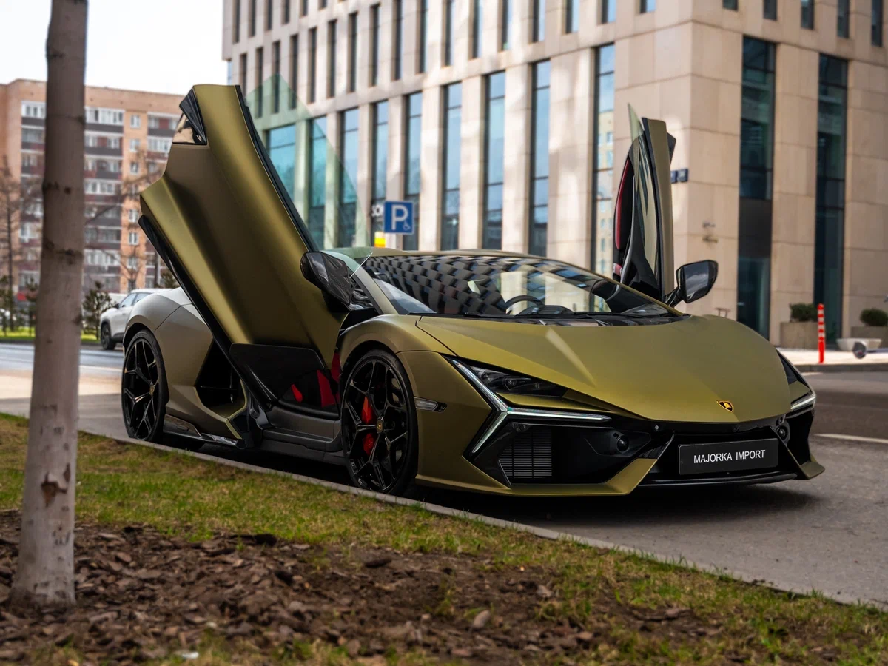
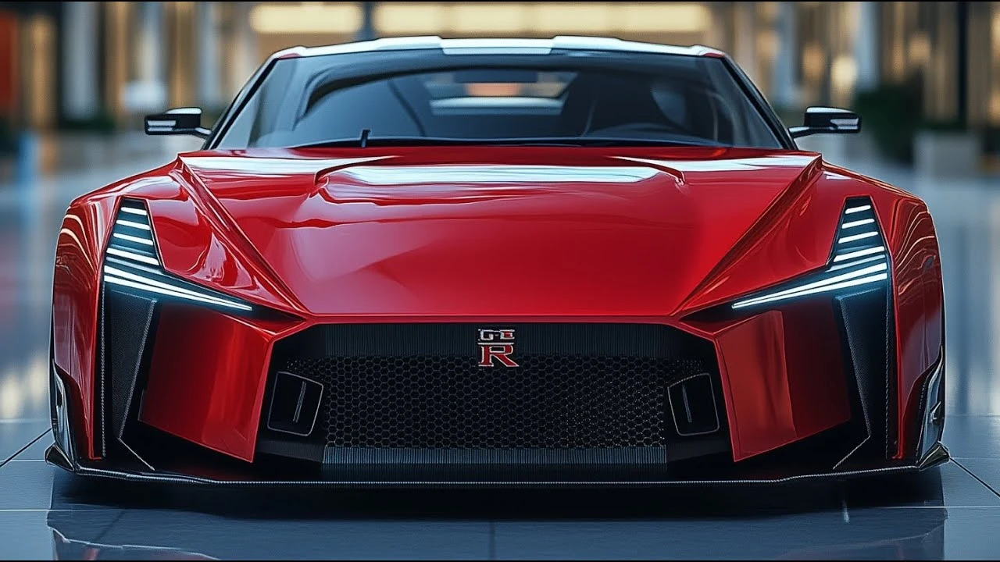

Основано на ранее сформулированных целях (архитектура, контроль, предсказуемость, системность). Ниже — более глубокая декомпозиция крупных жизненных задач в инженерной логике: цель → метрика → этапы → критерий достижения.

---

# 🎯 Стратегические цели

---

## 🏠 1. Купить дом

### 🎯 Цель

Приобрести дом как актив, обеспечивающий:

* стабильность проживания
* финансовую устойчивость
* независимость от аренды

---

### 📊 Критерии

* Дом в собственности (без обременений)
* Платёж ≤ 30–35% чистого дохода
* Резерв ≥ 6–12 месяцев расходов
* Ликвидность локации (спрос, инфраструктура)

---

### 🧩 Подзадачи

**Финансовый блок**

* Расчёт целевой стоимости объекта
* Формирование первоначального взноса
* Стратегия: ипотека / кэш / комбинированная
* Подготовка кредитного профиля

**Инвестиционный анализ**

* ROI локации
* Рост стоимости за 5–10 лет
* Альтернатива: сдача в аренду

**Технический блок**

* Проверка юридической чистоты
* Инженерные коммуникации
* Энергоэффективность
* Расходы на содержание

---

### 📌 Метрика прогресса

* % от накопленной суммы
* DTI (debt-to-income)
* Динамика капитала

---

## 🏎 2. Купить Lamborghini

### 🎯 Цель

Приобрести Lamborghini как символ:

* финансового уровня
* достижения high-performance статуса
* личной мотивации

---

### 📊 Критерии

* Покупка без ухудшения финансовой устойчивости
* Активы ≥ 5–10× стоимости авто
* Полное покрытие обслуживания и страховки

---

### 🧩 Подзадачи

**Финансовая устойчивость**

* Капитал, генерирующий пассивный доход
* Авто ≤ 10–15% чистых активов

**Эксплуатационные расходы**

* Страхование
* Сервис
* Хранение

**Стратегия владения**

* Новая / с пробегом
* Импорт / локальный рынок
* Лизинг vs покупка

---

### 📌 Метрика прогресса

* Net worth
* Доля пассивного дохода
* Коэффициент финансовой свободы

---

## 🏁 3. Купить Nissan GT-R

### 🎯 Цель

Приобрести Nissan GT-R как:

* performance-проект
* управляемый high-tech автомобиль
* более рациональную альтернативу суперкару

---

### 📊 Критерии

* Покупка без кредитной нагрузки
* Резерв на тюнинг / обслуживание
* Понимание рынка (R35 / поколение / состояние)

---

### 🧩 Подзадачи

**Аналитика рынка**

* Год выпуска
* Пробег
* История обслуживания
* Модификации

**Финансовый блок**

* 100% суммы + 20% резерв
* Стоимость владения в год

**Технический блок**

* Проверка трансмиссии
* Проверка турбин
* Диагностика ECU

---

### 📌 Метрика прогресса

* Сформированный бюджет
* Выбранный целевой экземпляр
* Готовность сделки

---

# 📈 Общая стратегия достижения

1. Рост активного дохода
2. Создание источника пассивного дохода
3. Инвестирование (диверсификация)
4. Контроль долговой нагрузки
5. Системный финансовый учёт

---

Если нужно, могу:

* построить пошаговый 5–10 летний план
* рассчитать примерную финансовую модель
* сравнить Lamborghini vs GT-R по TCO
* сделать таблицу приоритетов: дом → GT-R → Lamborghini

Без предположений о твоём текущем доходе — расчёты потребуют исходных данных.
